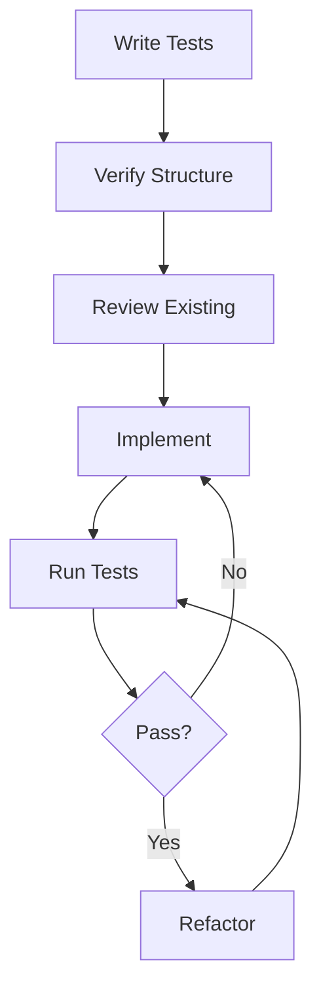

# Prism Architecture Guide

## Core Principles

1. Test-Driven Development
- All features start with tests
- Tests must include confidence verification
- Context transitions must be tested
- LLM interactions must be mocked appropriately

2. Directory Structure
```
prism/
├── src/
│   ├── core/           # Core language features
│   │   ├── ast.rs      # Abstract Syntax Tree
│   │   ├── parser.rs   # Parser implementation
│   │   └── runtime.rs  # Runtime engine
│   ├── confidence/     # Confidence handling
│   │   ├── types.rs    # Confidence types
│   │   └── calc.rs     # Confidence calculations
│   ├── context/        # Context management
│   │   ├── manager.rs  # Context handling
│   │   └── stack.rs    # Context stack
│   └── llm/           # LLM integration
│       ├── provider.rs # Provider interface
│       └── gemini.rs  # Gemini implementation
├── tests/
│   ├── core/          # Core tests
│   ├── confidence/    # Confidence tests
│   ├── context/       # Context tests
│   └── llm/          # LLM integration tests
└── docs/
    ├── core/          # Core documentation
    ├── confidence/    # Confidence documentation
    ├── context/       # Context documentation
    └── llm/          # LLM documentation
```

3. Development Flow


4. Testing Pattern
```rust
#[cfg(test)]
mod tests {
    use super::*;

    // Context setup helper
    fn setup_test_context() -> Context {
        // Setup code
    }

    #[test]
    fn test_feature() {
        // Given: Setup
        let context = setup_test_context();
        
        // When: Action
        let result = feature_under_test();
        
        // Then: Verify
        assert_eq!(result.value, expected);
        assert!(result.confidence > 0.8);
    }
}
```

## Key Interfaces

1. Confidence Handling
```rust
pub trait Confident {
    fn confidence(&self) -> f64;
    fn with_confidence(self, confidence: f64) -> Self;
}
```

2. Context Management
```rust
pub trait ContextAware {
    fn current_context(&self) -> &Context;
    fn in_context<F>(&mut self, context: Context, f: F) 
    where F: FnOnce(&mut Self);
}
```

3. LLM Provider
```rust
pub trait LLMProvider {
    async fn complete(&self, prompt: &str) -> Result<LLMResponse, Error>;
    async fn embed(&self, text: &str) -> Result<Vec<f64>, Error>;
}
```

## Development Guidelines

1. Code Organization
- One module per feature
- Clear separation of concerns
- Explicit confidence handling
- Comprehensive error types

2. Testing Requirements
- Unit tests for all features
- Integration tests for components
- Property-based tests for confidence
- Mock LLM calls in tests

3. Documentation
- API documentation
- Architecture updates
- Usage examples
- Test documentation

4. Error Handling
- Custom error types
- Confidence levels in errors
- Context preservation
- Clear error messages

## Quality Checks

Before each commit:
1. All tests pass
2. Documentation updated
3. Error handling verified
4. Confidence calculations checked
5. Context management validated